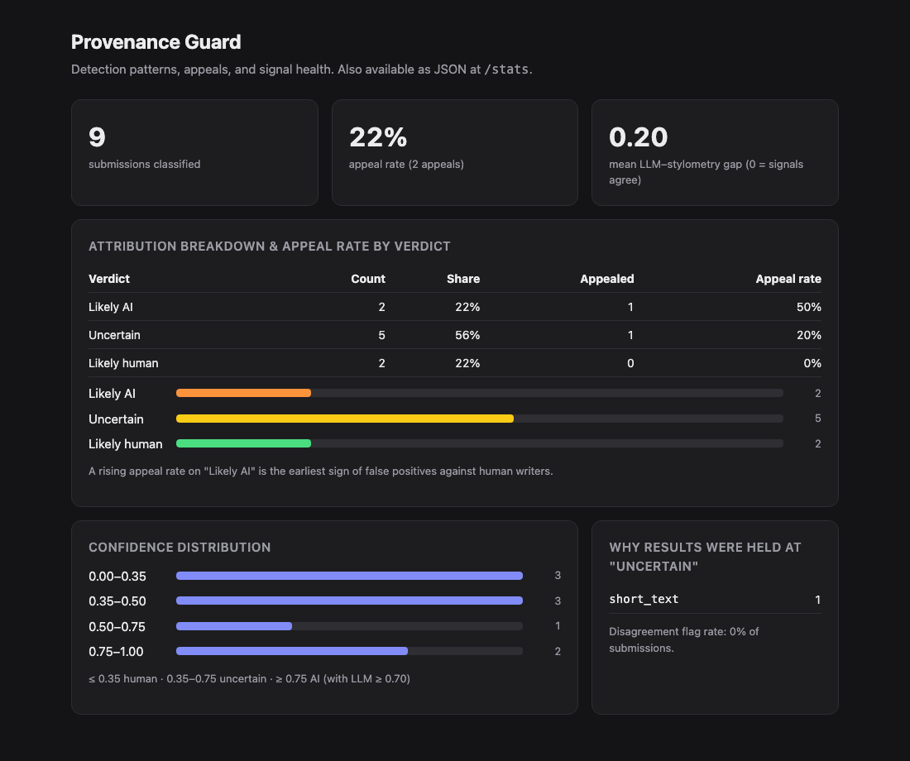

# Provenance Guard

A backend service that a creative-writing platform can plug in to estimate whether a submitted piece of text was written by a person or generated with AI. It returns a confidence score and a plain-language transparency label for readers. It lets creators appeal a result, and it records every decision in a structured audit log.

Perfect AI detection is an unsolved problem, so the system is built around **being honest about uncertainty**. Labelling a human's work as AI-generated is treated as the worst mistake it can make. Most ambiguous text is labelled "Origin unclear" rather than accused, and every result can be appealed to a human reviewer.

The full design spec, including the architecture diagram and a change log of every place the implementation diverged from the plan, is in [planning.md](planning.md).

---

## Quick start

```bash
python -m venv .venv && source .venv/bin/activate
pip install -r requirements.txt
echo "GROQ_API_KEY=your_key_here" > .env
python app.py                      # serves on http://localhost:5001
```

> **Port 5001, not 5000:** on macOS the AirPlay Receiver occupies port 5000 and answers every request with `403`. Set `PORT=5000` to override. The Groq model can be changed with `GROQ_MODEL`.

```bash
# classify a piece of text
curl -s -X POST http://localhost:5001/submit -H "Content-Type: application/json" \
  -d '{"text": "ok so i finally tried that new ramen place downtown and honestly? underwhelming...", "creator_id": "writer-1"}' | python -m json.tool

# appeal it (use the content_id from the response)
curl -s -X POST http://localhost:5001/appeal -H "Content-Type: application/json" \
  -d '{"content_id": "PASTE-ID", "creator_id": "writer-1", "creator_reasoning": "I wrote this myself from personal experience."}' | python -m json.tool

curl -s http://localhost:5001/log | python -m json.tool     # audit log
python -m scripts.calibrate                                  # print all signals for the test inputs
```

### Endpoints

| Method & path | Purpose | Rate limit |
|---|---|---|
| `POST /submit` | Classify `{text, creator_id}`. Returns `content_id`, `attribution`, `confidence`, each signal's output, `flags`, `label`, `status` | 10/min, 100/day per IP |
| `POST /appeal` | Contest a result: `{content_id, creator_id, creator_reasoning}` | 5/hour per IP |
| `GET /content/<id>` | Current state of one submission, including its appeal status | — |
| `GET /appeals` | Human reviewer queue: text, original decision, all signals, and the creator's reasoning, oldest first | — |
| `GET /log?limit=N` | Structured audit log, newest first | — |
| `GET /stats` · `GET /dashboard` | Analytics as JSON or as an HTML page (stretch feature) | — |

---

## Architecture overview

A submission follows this path from input to transparency label:

```
POST /submit ─► rate limiter ─► input validation
     │ raw text
     ├─► Signal 1: LLM judgment (Groq)      ─► llm_score 0–1 + reasoning
     ├─► Signal 2: stylometric statistics   ─► stylo_score 0–1 + metrics
     └─► Signal 3: AI-phrase lexicon        ─► lexicon_score 0–1 + matched phrases
                    │ three scores + word count
                    ▼
          confidence scoring (weighted sum + override rules) ─► confidence + attribution + flags
                    ▼
          label generator ─► label title + text
                    ▼
          SQLite: submissions (current state) + audit_log (append-only "classified" event)
                    ▼
          JSON response with content_id

POST /appeal ─► rate limiter ─► checks: content exists (404) · caller is the creator (403) · not already appealed (409)
     ─► submissions.status = "under_review" ─► audit_log "appeal_filed" event (with the original decision)
     ─► confirmation with appeal_id ─► shows up in GET /appeals for a human reviewer
```

1. **`app.py`** rate-limits and validates the request: the text must be non-empty and at most 10,000 characters, and a `creator_id` is required.
2. The text goes to three independent signal functions in `signals/`. Each returns a score on the same scale: **0 = human-like, 1 = AI-like**.
3. **`scoring.py`** combines them into one confidence score. It then applies the override rules (short text, the two main signals disagreeing, the Groq score not leaning AI strongly enough on its own, Groq unavailable), which can force the result to "uncertain."
4. **`labels.py`** turns the attribution into reader-facing text.
5. **`db.py`** saves the current state in `submissions` and appends a `classified` event to `audit_log`.

An appeal changes the submission's status and appends an `appeal_filed` event. The original event is never modified, so the log always shows what was decided and when.

---

## Detection signals

Three signals, chosen so they fail in *different* ways:

| | What it measures | Why it differs between human and AI text | What it misses |
|---|---|---|---|
| **1. LLM judgment** (`signals/llm.py`, Groq `openai/gpt-oss-120b`, temperature 0, JSON mode) | A holistic read of meaning and style: generic hedging, formulaic transitions, balanced-but-empty structure, lack of concrete personal detail. Returns `ai_probability` and a one-sentence reason. | LLM output drifts toward statistically average phrasing, and another LLM is good at recognizing that register. | It's overconfident, and it can be fooled by AI text prompted to sound casual. It sometimes reads formal or non-native writing as AI. Its score for the same text varies across runs: about ±0.02 on clear cases, and up to 0.20–0.60 on the non-native sample. |
| **2. Stylometry** (`signals/stylometry.py`, pure Python) | Structure only: **how much sentence lengths vary** (40%), **average word length** (25%), and **how often informal markers appear** (35%): contractions, lowercase "i", `!?…`, parentheses, ALL-CAPS, dashes. | AI prose is uniform: similar sentence lengths, elevated vocabulary, clean punctuation. Human writing is irregular. | Meaning. Formal academic prose, non-native writers, and poetry built on deliberate repetition all look "uniform." Casual-sounding AI text looks human. It's unreliable under about 3 sentences. |
| **3. AI-phrase lexicon** (`signals/lexicon.py`, stretch feature) | How densely the text uses about 45 stock LLM phrases ("it is important to note", "furthermore", "delve", "landscape", "leverage", "stakeholders"…). 3 or more per 100 words gives a score of 1.0. Returns the matched phrases so a reviewer can see why. | Assistant-style models overuse a recognizable vocabulary. | Trivially evaded by paraphrasing. Human corporate and academic writing uses the same words. The list goes stale as models change. |

**Why these signals:** the LLM is semantic and stylometry is structural, and the two are genuinely independent. The lexicon adds a third, very transparent angle: word choice. When the signals agree, that's real evidence. When the LLM and stylometry disagree sharply, the disagreement is itself informative: it means "we don't know," and the system says so.

---

## Confidence scoring

### What the number means

`confidence` is the estimated **likelihood that the text is AI-generated**, from 0 to 1:
- **0.5 means "the evidence is balanced."** It is not a coin-flip verdict.
- The thresholds are **deliberately lopsided**, because a false "AI" label can damage a real writer while a missed AI text is a less harmful error.

```
confidence = 0.5 · llm + 0.3 · stylometry + 0.2 · lexicon
```

The LLM carries the most weight because it uses the most information. The lexicon carries the least because it's the easiest to game and the most prone to flagging formal human writing.

| Confidence | Attribution | Label |
|---|---|---|
| **≥ 0.75**, *and* the Groq score itself ≥ 0.70 | `likely_ai` | 🤖 Likely AI-generated |
| **0.36 – 0.74** | `uncertain` | ❔ Origin unclear |
| **≤ 0.35** | `likely_human` | ✍️ Likely human-written |

The AI band starts 0.25 above the midpoint, while the human band needs only 0.15 below it. On top of the thresholds, four override rules force "uncertain" and record a flag explaining why:

| Flag | Condition | Why |
|---|---|---|
| `llm_unavailable` | Groq errored | Never accuse on heuristics alone. The confidence falls back to `0.6·stylo + 0.4·lexicon`. |
| `short_text` | Under 30 words | Too little text to measure anything. |
| `signal_disagreement` | `\|llm − stylometry\| > 0.45` | The meaning-based signal and the structure-based signal are telling different stories. |
| `weak_llm_evidence` | The score reaches the AI band but Groq's own score is under 0.70 | The heuristic signals can support an AI verdict, but can never produce one on their own. |

### How I validated it

`python -m scripts.calibrate` runs a fixed set of deliberately chosen inputs (in `scripts/test_inputs.py`) and prints every signal next to the combined result:
- the four provided test inputs
- a second, longer AI sample
- a repetitive poem
- a non-native writer's paragraph
- a human-written corporate email (the lexicon's blind spot)

The pass criteria, written in [planning.md](planning.md) before tuning, were:
- the AI samples reach ≥ 0.75
- the casual human text reaches ≤ 0.35
- every borderline case lands in "uncertain," or the reason it doesn't is explained

Final run (three-signal ensemble):

| Input | Words | LLM | Stylo | Lexicon | **Confidence** | Attribution |
|---|---|---|---|---|---|---|
| Clear AI (provided) | 43 | 0.86 | 0.77 | 1.00 | **0.860** | likely_ai |
| Clear AI, long | 69 | 0.82 | 0.94 | 1.00 | **0.891** | likely_ai |
| Clear human, ramen review (provided) | 55 | 0.15 | 0.11 | 0.00 | **0.109** | likely_human |
| Formal human, monetary policy (provided) | 43 | 0.55 | 0.96 | 0.00 | **0.563** | uncertain |
| Lightly edited AI, remote work (provided) | 39 | 0.55 | 0.55 | 0.00 | **0.439** | uncertain |
| Repetitive poem (human) | 56 | 0.40 | 0.75 | 0.00 | **0.425** | uncertain |
| Non-native formal (human) | 69 | 0.35 | 0.66 | 0.00 | **0.373** | uncertain |
| Corporate email (human) | 55 | 0.15 | 0.13 | 1.00 | **0.313** | likely_human |
| Haiku | 14 | 0.55 | 0.13 | 0.00 | **0.314** | uncertain (`short_text`) |

**Two examples with very different confidence:**
- **High confidence, "Artificial intelligence represents a transformative paradigm shift…":** confidence **0.860** → *Likely AI-generated*. All three signals agree: LLM 0.86, stylometry 0.77 (uniform sentences, average word length 6.2 characters), and 6 stock phrases found, including "it is important to note", "furthermore" and "paradigm".
- **Lower confidence, "I've been thinking a lot about remote work lately…":** confidence **0.439** → *Origin unclear*. The LLM (0.55) and stylometry (0.55) both sit near the middle. The contractions and the dash lowered the stylometric score, and there are no stock phrases. This is lightly edited AI output, and "unclear" is the honest answer.

What the table shows:
- **The clear AI and clear human texts are far apart:** 0.86–0.89 vs. 0.11.
- **Stylometry alone gets three human texts wrong,** exactly as its blind spots predict: formal prose 0.96, the poem 0.75, the non-native writer 0.66.
- **The design catches those errors:** the LLM weighting and the LLM-floor rule keep all three at "uncertain" rather than accusing them.

---

## Transparency labels

Readers see one of these three labels. They deliberately don't show raw percentages ("73% AI" invites over-reading). Each states the verdict, how sure we are in plain words, and a reminder that detection can be wrong. The exact text:

| Variant | When shown | Title | Label text |
|---|---|---|---|
| **High-confidence AI** | `likely_ai` | 🤖 Likely AI-generated | "Our analysis found strong, consistent signs that this text was generated with AI tools. Automated detection isn't perfect — the creator can appeal this label, and appealed work is reviewed by a person." |
| **High-confidence human** | `likely_human` | ✍️ Likely human-written | "Our analysis found strong signs that this text was written by a person. No detection system is perfect, but we found no meaningful indicators of AI generation." |
| **Uncertain** | `uncertain` | ❔ Origin unclear | "We couldn't confidently tell whether this text was written by a person or with AI assistance. This is not an accusation — many human writers get this result. Consider the creator's own description of their work." |

When content is under appeal, this sentence is added to whichever label it has: **"The creator has appealed this result; it is under review."**

Design choices:
- **The uncertain label says "This is not an accusation" outright.** A mid-range score is where a human writer is most likely to feel accused.
- **The AI label points to the appeal path in the same breath** as the verdict.
- **The label text lives in one place** ([labels.py](labels.py)), and a check during development confirmed it matches [planning.md](planning.md) word for word.

---

## Appeals workflow

- **Who can appeal:** only the creator who submitted the content. The request's `creator_id` must match the stored one; otherwise the response is `403`. In production this would be tied to real authentication.
- **What they provide:** `content_id` plus `creator_reasoning` (10–2,000 characters).
- **What happens:**
  1. The submission's status changes from `classified` to `under_review`, and the reasoning and timestamp are stored.
  2. An `appeal_filed` event is appended to the audit log. It carries the **original** attribution, confidence and all signal scores, plus the reasoning and an `appeal_id`.
  3. The response confirms the new status and echoes the original decision.

  The status change is one conditional SQL update, so two simultaneous appeals can't both succeed; the second gets `409`.
- **What a reviewer sees** (`GET /appeals`): the full text, the original verdict and label, the LLM's score and reasoning, the stylometric metrics, the matched lexicon phrases, any flags, and the creator's explanation, oldest appeal first. Automated re-classification is intentionally not implemented; a person decides.

Sample `/appeal` response (from [docs/evidence/submit_and_appeal_responses.json](docs/evidence/submit_and_appeal_responses.json), captured in M5 before the lexicon signal was added, so the confidence differs from the audit-log sample below):

```json
{
  "appeal_id": "7b4cba6f-eb66-4326-8d94-70596bb7690c",
  "content_id": "93d5f85c-fe60-4a8e-82c1-f2b30e34ffb8",
  "status": "under_review",
  "original_decision": { "attribution": "uncertain", "confidence": 0.534 },
  "label": {
    "variant": "uncertain",
    "title": "❔ Origin unclear",
    "text": "We couldn't confidently tell whether this text was written by a person or with AI assistance. This is not an accusation — many human writers get this result. Consider the creator's own description of their work. The creator has appealed this result; it is under review."
  },
  "message": "Your appeal has been received and will be reviewed by a person."
}
```

---

## Rate limiting

Configured in [app.py](app.py) (`SUBMIT_LIMIT`, `APPEAL_LIMIT`) with Flask-Limiter, keyed by client IP:

| Endpoint | Limit | Reasoning |
|---|---|---|
| `POST /submit` | **10 per minute; 100 per day** | A real writer posts a handful of pieces per session; even someone uploading a back catalog rarely exceeds one every 6 seconds. 10/min absorbs that burst while stopping a flooding script within seconds. 100/day covers very heavy legitimate use, caps how much of the shared Groq free-tier quota one client can burn, and slows an adversary who submits many small variations of a text to find one that slips past the detector. |
| `POST /appeal` | **5 per hour** | Appeals are rare and deliberate (one per piece is allowed anyway). A tight limit keeps the human review queue from being spammed. |

The limits are keyed by IP rather than `creator_id`, because `creator_id` is supplied by the client and trivially faked. A spammer could rotate it to dodge a per-creator limit. Storage is `memory://` for local development. A multi-process deployment would use Redis so that all workers share the counters.

**Evidence.** The assignment's 12-request loop against `/submit` ([docs/evidence/rate_limit_test.txt](docs/evidence/rate_limit_test.txt)):

```
200
200
200
200
200
200
200
200
200
200
429
429
```

The 429 response body:

```json
{ "error": "rate limit exceeded", "limit": "10 per 1 minute" }
```

---

## Audit log

Every decision is written to the append-only `audit_log` table in SQLite. Each row records:
- the timestamp, the event type (`classified` or `appeal_filed`), `content_id` and `creator_id`
- the attribution and confidence
- **each signal's individual score** and `signals_used`
- any flags, the status, and the appeal ID and reasoning

Rows are never updated. An appeal adds a new row alongside the original decision rather than editing it.

Sample from `GET /log`, newest first (full file: [docs/evidence/audit_log_sample.json](docs/evidence/audit_log_sample.json)). It contains three classifications and two appeals. The first classification and the first appeal are for the same `content_id`.

```json
[
  {
    "timestamp": "2026-09-29T21:48:18.732Z",
    "event": "appeal_filed",
    "content_id": "942a2ace-7282-4869-a6e9-75e9e2ffc213",
    "creator_id": "writer-edge_non_native_formal",
    "attribution": "uncertain",
    "confidence": 0.373,
    "llm_score": 0.35,
    "stylo_score": 0.661,
    "lexicon_score": 0.0,
    "signals_used": ["llm", "stylometry", "lexicon"],
    "flags": [],
    "status": "under_review",
    "appeal_reasoning": "I wrote this myself from personal experience. I am a non-native English speaker."
  },
  {
    "timestamp": "2026-09-29T21:48:18.727Z",
    "event": "appeal_filed",
    "content_id": "19efaff6-ed6b-41ab-9d6e-9601a93794fd",
    "creator_id": "writer-clear_ai",
    "attribution": "likely_ai",
    "confidence": 0.86,
    "llm_score": 0.86,
    "stylo_score": 0.768,
    "lexicon_score": 1.0,
    "signals_used": ["llm", "stylometry", "lexicon"],
    "flags": [],
    "status": "under_review",
    "appeal_reasoning": "I drafted this for a policy class; it's formal because the assignment required it."
  },
  {
    "timestamp": "2026-09-29T21:48:18.722Z",
    "event": "classified",
    "content_id": "12fb818f-f3d8-4afb-98f7-8b110eee294e",
    "creator_id": "writer-edge_corporate_human",
    "attribution": "likely_human",
    "confidence": 0.313,
    "llm_score": 0.15,
    "stylo_score": 0.128,
    "lexicon_score": 1.0,
    "signals_used": ["llm", "stylometry", "lexicon"],
    "flags": [],
    "status": "classified",
    "appeal_reasoning": null
  },
  {
    "timestamp": "2026-09-29T21:48:17.908Z",
    "event": "classified",
    "content_id": "4b8a4505-f1c1-40b2-8e61-93a7d06b335e",
    "creator_id": "writer-clear_ai_long",
    "attribution": "likely_ai",
    "confidence": 0.891,
    "llm_score": 0.82,
    "stylo_score": 0.937,
    "lexicon_score": 1.0,
    "signals_used": ["llm", "stylometry", "lexicon"],
    "flags": [],
    "status": "classified",
    "appeal_reasoning": null
  },
  {
    "timestamp": "2026-09-29T21:48:17.278Z",
    "event": "classified",
    "content_id": "942a2ace-7282-4869-a6e9-75e9e2ffc213",
    "creator_id": "writer-edge_non_native_formal",
    "attribution": "uncertain",
    "confidence": 0.373,
    "llm_score": 0.35,
    "stylo_score": 0.661,
    "lexicon_score": 0.0,
    "signals_used": ["llm", "stylometry", "lexicon"],
    "flags": [],
    "status": "classified",
    "appeal_reasoning": null
  }
]
```

(Each entry also includes `id` and `appeal_id`; they are trimmed here for readability.)

---

## Stretch features

### Ensemble detection (3 signals, weighted)

I added the **AI-phrase lexicon** as a third signal ([signals/lexicon.py](signals/lexicon.py)), described in the signals table above, and moved from a two-signal formula (`0.6·llm + 0.4·stylo`) to `0.5·llm + 0.3·stylo + 0.2·lexicon`. It was specified in [planning.md](planning.md) under "Stretch Features" and committed before any code.

Its effect on calibration:
- **The AI samples moved further above the 0.75 threshold:** 0.823 → 0.860 and 0.867 → 0.891, so the clear AI text no longer sits near the line.
- **The formal human paragraph moved further from an AI label:** 0.714 → 0.563.
- **Its blind spot is contained:** the human corporate email hits the lexicon's maximum score (1.0, with "leverage", "stakeholders", "landscape", "additionally" and "ultimately"), yet is still correctly labelled *likely human* at 0.313, because the lexicon carries only 20% of the weight and the LLM floor stops the heuristic signals from producing an AI verdict on their own.

Databases created before this change are migrated in place (`ALTER TABLE ADD COLUMN`).

### Analytics dashboard

`GET /stats` returns JSON and `GET /dashboard` renders it as a small HTML page with no JavaScript ([templates/dashboard.html](templates/dashboard.html)):
- **Detection patterns:** the count and share of each verdict, a confidence histogram whose band edges match the scoring thresholds, and how often each override flag fires.
- **Appeal rate:** overall and **per verdict**. The appeal rate on "Likely AI" is the earliest measurable sign of false positives against real writers.
- **Additional metric, signal agreement:** the mean gap between the Groq and stylometric scores, and the share of submissions flagged for disagreement. A rising gap means the signals are drifting apart and the thresholds need recalibration.

I verified every number by hand against the per-submission results for a seeded database. For example, 2 appeals out of 8 submissions = 25%, and the eight gaps between the Groq and stylometric scores sum to 1.343, giving a mean of 0.168.



---

## Known limitations

- **Formal human prose, especially from non-native English writers.** Stylometry scores textbook-careful writing as AI-like: few contractions, uniform sentence lengths, no informal punctuation. The monetary-policy paragraph scored **0.96** on stylometry, and the non-native paragraph **0.66**. The system keeps them at "uncertain" only because the LLM hedged. If the LLM also leaned AI on such a text (it scored the non-native sample anywhere from 0.20 to 0.60 across runs), a real person's careful writing could get the AI label. This is the most likely serious false positive, and the reason the appeal path exists.
- **Lightly edited or style-prompted AI text.** Adding contractions, a first-person opener and a dash pushes the informality score toward "human," and avoiding stock phrases zeroes the lexicon. The remote-work sample, which is AI-generated, scored only **0.439**. A motivated user can reliably get "uncertain" for AI text. The system is built to avoid false accusations, not to catch determined evaders.
- **Poetry and other deliberately repetitive forms.** Refrains and equal-length lines make sentence-length variation almost zero, so the repetitive poem got a stylometric score of **0.75**. Sentence splitting also treats each line break as a sentence, which misreads verse, lists and dialogue.
- **LLM inconsistency.** Even at temperature 0, the Groq model's score varies between runs: about ±0.02 on clear cases, much more on ambiguous ones. The same text submitted twice can land on different sides of a threshold if it sits near one. The initial 0.80 AI threshold had exactly this problem (see the spec reflection below).
- **English only**, and all constants were calibrated on a small hand-picked set of 9 inputs. That's enough to show the scores are meaningful, but nowhere near a statistically calibrated detector.

**What I'd change for a real deployment:**
- Calibrate the weights and thresholds on a labelled dataset of a few thousand texts, per genre.
- Average several LLM calls to reduce jitter.
- Give poetry its own stylometric profile.
- Use real authentication instead of a `creator_id` field.
- Use Redis-backed rate limits.
- Add reviewer endpoints that resolve appeals (`upheld` / `overturned`) and feed those outcomes back into calibration.

---

## Spec reflection

**Where the spec helped.** Writing the override rules and blind spots down *before* coding made calibration a matter of checking the design rather than guessing. The spec predicted that stylometry would misread formal human prose and repetitive poetry. When the first calibration run showed exactly that (0.96 and 0.75), there was already a designed answer: the LLM carries the most weight, and the disagreement rule sends conflicting cases to "uncertain." The exact label text and the API contract in the spec also made verification mechanical. The label strings were checked word for word against `planning.md`, and every appeal error code (400, 403, 404, 409) was tested because the contract listed them.

**Where the implementation diverged, and why.** The first calibration run showed the spec's thresholds were wrong in two ways. Every change is logged in the Change Log in [planning.md](planning.md).
1. **A cutoff that blocked every provided input.** The 50-word short-text rule forced three of the four provided test inputs (39–43 words) to "uncertain," so no paragraph-length post could ever get a definite label. I lowered it to 30 words.
2. **A threshold inside the LLM's noise band.** The 0.80 AI threshold sat inside Groq's run-to-run jitter. The clear AI sample scored 0.799–0.823 across runs, so identical text flip-flopped between labels. I lowered it to 0.75.

Lowering the AI threshold would have left the formal human paragraph only 0.04 from an AI label, so I also added a rule the spec didn't have: an AI verdict requires Groq's own score to be at least 0.70. The heuristic signals can now support an accusation but never make one on their own.

A smaller divergence: the course's default model (`llama-4-scout`) has been retired on Groq, so the LLM signal uses `openai/gpt-oss-120b`.

---

## AI usage


I built this with Claude Code as a pair programmer, milestone by milestone, giving it the relevant `planning.md` sections as the spec for each step.

1. **Scoring logic (M4).** I directed the AI to implement `combine()` from the spec's weights, thresholds and override rules, then to run the calibration inputs before wiring it into the endpoint. The first implementation matched the spec exactly. Running it showed the clear AI sample landing at 0.799, just under the 0.80 threshold. Rather than accept a tweak on one data point, we measured Groq's variance across four repeated runs, added a second AI sample, and only then changed the threshold. We also added the LLM-floor rule so the formal human paragraph couldn't slide into the AI band. Every change and its reason was recorded in `planning.md`.
2. **Appeals endpoint (M5).** I directed the AI to build `POST /appeal` from the Appeals Workflow section. The first version generated an `appeal_id` in the response but never stored it, so the ID in the response couldn't be traced in the audit log. That was caught in review and fixed by storing `appeal_id` on both the submission and the `appeal_filed` log event. The status update was also rewritten as a single conditional `UPDATE … WHERE status = 'classified'` so a duplicate appeal fails cleanly with 409 instead of racing.
3. **Dashboard (stretch).** The first histogram used half-open bands, which put a score of exactly 0.35 (a "likely human" verdict) into the 0.35–0.50 band. That was revised so the band edges match the scoring thresholds. The first layout also squeezed the histogram bars into a narrow card; this was fixed after inspecting a headless-browser screenshot.
4. **LLM signal (M3).** The generated Groq call used the course's default model, which returned `NotFoundError`. Instead of hard-coding a replacement, we listed the models available to the account, chose `openai/gpt-oss-120b`, and made it overridable via `GROQ_MODEL`. The failure path (return `score: None` plus a flag, never crash, never treat a failure as 0) was kept and is enforced in scoring.

---

## Walkthrough video

> 🎥 https://youtu.be/yJNrM_EJuEI 

---

## Project layout

```
app.py                  Flask routes, validation, rate limits
scoring.py              weighted combination, thresholds, override rules
labels.py               the three transparency labels (exact text)
db.py                   SQLite schema + migration, audit log, appeals, stats
signals/llm.py          Signal 1: Groq LLM judgment
signals/stylometry.py   Signal 2: sentence-length variation, word length, informality
signals/lexicon.py      Signal 3: AI-phrase density
scripts/test_inputs.py  calibration inputs (provided + edge cases)
scripts/calibrate.py    prints every signal for every input
templates/dashboard.html analytics page
docs/evidence/          audit log, rate-limit, appeal, stats samples + dashboard screenshot
planning.md             design spec, architecture diagram, AI tool plan, change log
```
